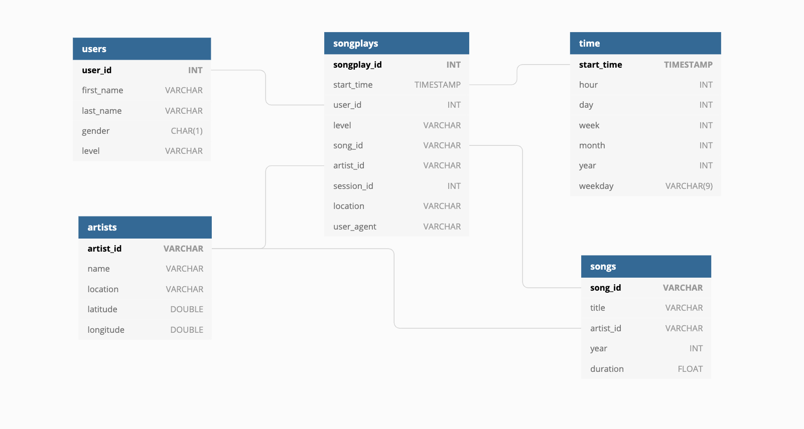

# Data Modeling with PostgreSQL

This goal of this project is to create a relational database for a fictional music streaming service. The service only has song and log data in the form of JSON files, so there are two main tasks:

1. model a relational database optimized for analyzing what songs users are listening to in the app
2. perform ETL processes on the data files to populate the newly created database

The database created follows a star schema and is made up of one fact table and four dimension tables:



**Fact** - songplays

**Dimension** - users, songs, artists, time

Information from the data files are loaded into this database with the help of Pandas. More details can be found below.

## Files and Directories

### Files

`sql_queries.py` - Acts as a helper to `create_tables.py` and `etl.py`. Contains the SQL queries used to manipulate the fact and dimension tables of the sparkify database.

`create_tables.py` - Utilizes the psycopg2 library to DROP and CREATE tables. This file should be run to create the sparkify database with empty fact and dimension tables.

`etl.py` - Performs the major ETL processes on the song and log files. 

1. Extracts file information into Pandas Dataframes
2. Transforms and fit the data to the Postgres schema
3. Load the file information into Postgres via the psycopg2 driver

**Additional Files**

`etl.ipynb` - functions as `etl.py` but in the form of a jupyter notebook to test code incrementally

`test.ipynb` - checks to see if data has been added to the database after running the primary scripts

### Directories

`/song_data` - Contains songs from the [Million Song Dataset](http://millionsongdataset.com/). Files are JSON formatted.

```json
{
	"num_songs": 1,
	"artist_id": "ARD7TVE1187B99BFB1",
	"artist_latitude": null,
	"artist_longitude": null,
	"artist_location": "California - LA",
	"artist_name": "Casual",
	"song_id": "SOMZWCG12A8C13C480",
	"title": "I Didn't Mean To",
	"duration": 218.93179,
	"year": 0
}
```

`/log_data` - Contains user activity logs. Files are JSON formatted.

```json
{
	"artist":null, 
	"auth":"LoggedIn",
	"firstName":"Walter",
	"gender":"M",
	"itemInSession":0,
	"lastName":"Frye",
	"length":null,
	"level":"free",
	"location":"San Francisco-Oakland-Hayward, CA",
	"method":"GET",
	"page":"Home",
	"registration":1540919166796.0,
	"sessionId":38,"song":null,
	"status":200,
	"ts":1541105830796,
	"userAgent":"\"Mozilla\/5.0 (Macintosh; Intel Mac OS X 10_9_4) AppleWebKit\/537.36 (KHTML, like Gecko) Chrome\/36.0.1985.143 Safari\/537.36\"",
	"userId":"39"
}
```


## Running the Scripts

Clone this repository, then install any project dependencies found in `requirements.txt`. Next, ensure Postgres is installed locally before running any scripts. Create a parent database `studentdb` with the following credentials: 

```
host=127.0.0.1
dbname=studentdb
user=student
password=student
```

Now for the scripts: 

1. Run `create_tables.py` to create the sparkify database
2. After ensuring the tables are created, run `etl.py` to populate the database with the files found in the `/data` directory 
3. *(Optional)* Run `test.ipynb` to check if the database has been populated correctly

**Note:** if any changes are made to `etl.py` or the database schema, run`create_tables.py` to recreate the database